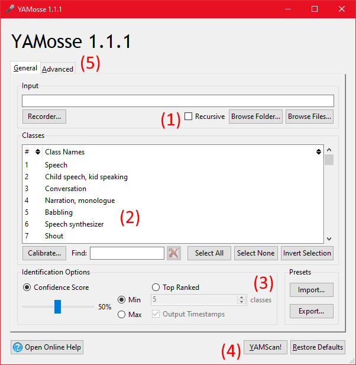

# YAMosse 1.1.0

Get timestamps for sound files by harnessing the power of pristine quality yams.

**IMPORTANT:** this application requires Python 3.10 64-bit or newer. Please note that (as of September 2025) TensorFlow does not officially support Python 3.13.

YAMosse is an easy to use interface for TensorFlow's [YAMNet](https://github.com/tensorflow/models/tree/master/research/audioset/yamnet) model, written in Python. It can be used to identify the timestamps of specific sounds, or create a transcript of the sounds in a sound file. For example, you could use it to tell which parts of a sound file contain music, or which parts contain speech. It could be used to annotate a collection of sounds, or as part of an automatically generated caption system. You can use it as a GUI or use it on the command line.

YAMosse has been tested on Windows 10 and on Ubuntu 24.04 LTS. It is recommended that you have at least 8 GB of RAM.

# Installation

Use Git to clone this repository, then use pip to install the following Python packages:

 - [`numpy`](http://www.numpy.org/)
 - [`tf-keras`](https://github.com/keras-team/tf-keras) or [`keras`](https://keras.io) (`tf-keras` is recommended)
 - [`tensorflow`](http://www.tensorflow.org/)
 - [`resampy`](https://resampy.readthedocs.io/en/stable/)
 - [`soundfile`](https://github.com/bastibe/python-soundfile)
 - [`psutil`](https://github.com/giampaolo/psutil) (only required on Windows)
 - [`tkinterdnd2`](https://github.com/Eliav2/tkinterdnd2) (optional, for drag and drop support)
 - [`PyTaskbar`](https://github.com/N3RDIUM/PyTaskbar) (optional, to show taskbar progress, Windows only)
 - [`tensorflow-hub`](https://github.com/tensorflow/hub) (optional, see below)

In addition to the above packages, you must install the YAMNet model to use YAMosse. If the YAMNet model is not installed, the application will run, but when you perform a YAMScan an import error will occur and the scan will be cancelled.

There are two methods you can use to install the YAMNet model: installing via TensorFlow Hub, or via TensorFlow Model Garden.

## Method 1: TensorFlow Hub

The easiest way to install the YAMNet model is by using TensorFlow Hub. All you need to do is use pip to install the `tensorflow-hub` package. The YAMNet model will be automatically loaded the first time you perform a YAMScan. An internet connection will be required, but only the first time.

However, installing the `tensorflow-hub` package *will also update your TensorFlow version.* If you would like to stay on an older version of TensorFlow, you should use Method 2 instead.

## Method 2: TensorFlow Model Garden

After using Git to clone the YAMosse repository, run a submodule update. The submodule update will clone the [TensorFlow Model Garden](https://github.com/tensorflow/models/) repository. Then you can run YAMosse and it will be able to load the YAMNet model from that repository. The weights file, which is not included in the TensorFlow Model Garden, will be downloaded separately the first time you perform a YAMScan.

## Optional: Recording

YAMosse has an optional feature that allows you to record sounds from an input device such as your microphone, directly within the application. To enable this feature, run the command `pip install sounddevice --user` in a command prompt. If you are on Linux, you will also need to manually install PortAudio.

If you omit the `--user` argument, the [`sounddevice`](https://python-sounddevice.readthedocs.io/) package will be installed for all users, but this will require sufficient privileges. 

# Usage

To run YAMosse in a window, open the `yamosse_window.pyw` file by double clicking on it. Alternatively, you can run the command `pythonw -m yamosse` in a command prompt.

To run YAMosse with a console, open the `yamosse_console.py` file by double clicking on it. Alternatively, you can run the command `python -m yamosse` in a command prompt. Running YAMosse with a console will allow you to see TensorFlow's error logs, which is useful for troubleshooting GPU Acceleration.



The first step to using YAMosse is to select an input file or folders (1). Click the Browse Folder or Browse Files buttons to select the sound files you'd like to scan. If you select a folder and the Recursive option is checked, then subfolders will also be included in the scan. If you have the `tkinterdnd2` package installed, you can also select files or folders by clicking and dragging them.

The next step is to select the classes of sound you'd like to scan for (2). There are [521 classes to choose from,](https://github.com/tensorflow/models/blob/master/research/audioset/yamnet/yamnet_class_map.csv) including speech, music, various animals, instruments, forms of transportation, and lots more. If you'd like to scan for everything, use the Select All button to select every class.

The last step is to choose whether you'd like to use Confidence Score or Top Ranked identification (3). When Confidence Score identification is used, the results will be a list of the timestamps of the specific sound classes you've selected in the sound file (or the absence of those sounds, if you click the Max button instead of Min.) In contrast, when Top Ranked identification is used, the result is a transcript - or play by play of events - of the sounds that the model thinks are in the sound file, ignoring the classes that you have not selected.

Now all you need to do is click the YAMScan! button (4). Then just sit back, and wait while your sound files are scanned. When the scan is finished, click the Open Output File button to view the results.

If the results are not satisfactory, you can tweak some more advanced options on the Advanced tab (5). When you're on the Advanced tab, mousing over things will give tips explaining what they do.

## Command Line Interface

YAMosse also has a command line interface. If any of the command line arguments are specified, the command line interface will be used instead of the GUI.

 - `-rd` or `--restore-defaults`: restores the defaults.
 - `-r` or `--record`: records a new sound.
 - `-ip import_preset_file_name` or `--import-preset import_preset_file_name`: imports a preset file (in JSON format.)
 - `-ep export_preset_file_name` or `--export-preset export_preset_file_name`: exports a preset file (in JSON format.)
 - `-y output_file_name` or `--yamscan output_file_name`: performs a YAMScan.
 - `-o key value` or `--option key value`: sets the option with the specified key to the specified value. The keys and values are the same format as they appear in the JSON preset files. For example, `-o "input" "\"File1.wav File2.wav\""` would set the "input" option (corresponding to the Input file selection) to "File1.wav File2.wav" (which would scan both files, because multiple file selection is allowed.) Note the extra pair of escaped quotes around the filenames, because the value is expected to be a valid JSON literal.

Just like in the GUI, any options that you specify will be remembered for next time. Pass the `-rd` command line argument if you want to start from a clean slate.

## Module Interface

You can import YAMosse to use it in your own module. It will throw `SubsystemError` (from the subsystem module) if there is a reason the operation can't be performed.

```
import yamosse
import yamosse.subsystem

try:
  yamosse.yamosse(output_file_name='Output.txt')
except yamosse.subsystem.SubsystemError as ex:
  print(ex)
```

All of the keyword arguments are optional. If no keyword arguments are specified, calling the `yamosse` function will open the GUI. If any keyword arguments are specified, they will behave the same as the command line interface.

 - `restore_defaults`: True or False. If True, restores the defaults.
 - `record`: True or False. If True, records a new sound.
 - `import_preset_file_name`: A string containing the file name to import a preset from (in JSON format.)
 - `export_preset_file_name`: A string containing the file name to export a preset to (in JSON format.)
 - `output_file_name`: A string containing the output file name for a YAMScan.
 - `options_attrs`: A dictionary where the keys are option names and the values are their corresponding values (as Python types, **not** JSON strings.)

# FAQ

## What are the supported filetypes?

Any filetypes that libsoundfile can open are supported. This includes all standard sound file formats like WAV, MP3, OGG and FLAC. The full list of filetypes is quite long and can be seen when you click the Browse Files button in YAMosse.

## Does YAMosse support scanning videos?

To scan the audio from a video file with YAMosse, you first need to convert it to one of the supported sound file formats - such as MP3, for example - then scan the sound file. You could use [ffmpeg](https://ffmpeg.org) or [GoldWave](https://www.goldwave.com/goldwave.php) to do this. If the audio codec supports it, you can make the conversion process very fast by specifying to make a Direct Stream Copy (include `-c:a copy` as one of the command line arguments to ffmpeg.)

## When scanning MP3s, sometimes there are a lot of timestamps past the end of the file. Why?

This is due to a bug in libsoundfile where it misreports the length of MP3s that have album art in them. It is a problem with the `soundfile` package and cannot be fixed by YAMosse. For now, you can use an ID3 editor like [The GodFather](https://www.jtclipper.eu/thegodfather/) to remove the album art from your MP3s before scanning them.

## Can YAMosse scan for custom sounds? Is it possible to add more sound classes?

No. YAMosse is only able to scan for the 521 classes available in YAMNet, the full list of which can be found [on their repo.](https://github.com/tensorflow/models/blob/master/research/audioset/yamnet/yamnet_class_map.csv)

## Can YAMosse identify words and phrases?

No, YAMosse does not convert speech into text. It can only identify the 521 sound classes that are included in the YAMNet model. Speech recognition can already be done with other models like [Whisper,](https://github.com/openai/whisper) so this is out of scope for YAMosse.

## What is the difference between Confidence Score and Top Ranked identification?

When using Confidence Score identification, the output is determined by a percentage, representing how certain the model is that it identified a particular sound. The sound file is scanned from start to end. At any point in time where the score is greater than the Confidence Score percentage given for any of the selected classes, the timestamp is recorded. The result is a list of timestamps, like this example.

```
Speech: 0:10, 0:20 - 0:35, 0:40, 0:45 - 1:00
```

This output would indicate that there is is one second of speech (maybe a single word or exclamation) at ten seconds into the sound file, then 15 seconds of speech starting at 20 seconds into the sound file, and so on.

In contrast, using Top Ranked identification will create a transcript of the sounds that it thinks are the most likely to be in the sound file at any given time, ignoring any sound classes that you don't have selected. The result is a list of classes over time.

```
0:00 - 0:10: Music
0:10: Speech
0:11 - 0:20: Vehicle
0:20 - 0:35: Speech
```

As you can see, the timestamps are now in the left column, with the right column being the sounds that are playing at those times.

## Why are there gaps/missing time periods when using Top Ranked identification?

Sounds that are quieter than the Background Noise Volume (on the Advanced tab) are skipped, which is most obvious when using Top Ranked identification where some timestamps will be missing. You can set the Background Noise Volume to 0% to scan everything, though the missing time periods will probably just be silence.

## Why does Silence still appear in the results, even though the Background Noise Volume is not set to zero?

Silence is just one of the classes of sound that the YAMNet model can recognize like any other, and it is technically independent of the current volume level. In practice, if you're seeing Silence a lot but don't want to, you should either raise the Background Noise Volume more or just deselect it from the Classes list so it'll never be used (it's class #495 in the list.)

## Why do I get an error saying "could not find TaskbarLib.tlb?"

The TaskbarLib.tlb file is a requirement of PyTaskbar, one of the dependencies used by YAMosse. It is included in the root folder of the project, along with this README. The TaskbarLib.tlb file must be in your current working directory when you run YAMosse. If you run the YAMosse module from outside the project directory, you need to make sure the TaskbarLib.tlb file is there. Alternatively, you can uninstall PyTaskbar, because it is optional and YAMosse will work without it (but then you won't be able to see the progress of running scans in the taskbar.)

## When I run YAMosse, instead of a GUI I get a command line prompt asking "please enter the output file name." Why?

If the GUI fails to load because of a missing dependency, YAMosse will fallback into the command line interface. Because no arguments are specified in this case, it will ask for an output filename so it can perform a YAMScan. If this is not what you want, it is possible that your download is incomplete (there should be a "gui" folder within the yamosse module) or that your Python install is not properly configured for Tkinter.

## How do I get a single guess for an entire file?

If you just want to get one guess for what sound is contained in a short sound clip, use the Top Ranked identification (set to identify only one class,) then set the Timespan to zero on the Advanced tab.

Alternatively, under Timespan you can check the Span All box. Then, any sound that ever appears in the Top Ranked at any point throughout the sound file will be listed, which will provide a bit more nuanced detail while still collapsing everything to one result.

## How do I enable GPU Acceleration?

To use GPU Acceleration, you will need to [install NVIDIA CUDA Toolkit and cuDNN.](https://www.digitalocean.com/community/tutorials/install-cuda-cudnn-for-gpu) Note that if you are on Windows, the last version of TensorFlow to support GPU Acceleration is 2.10.0. Otherwise, you will need to use Linux or WSL2 in order to get GPU Acceleration.

I have tested and confirmed that YAMosse is compatible with TensorFlow 2.8.0 and Keras 2.8.0, which will work for this purpose if you want to avoid setting up virtualization, though do note that in this case you will need to install the legacy `keras` package rather than `tf-keras`.

You will know when GPU Acceleration is enabled and working correctly because "GPU Acceleration Enabled" will appear in the Log textbox whenever you perform a YAMScan. If you still can't get GPU Acceleration to work, try running YAMosse with a console by opening `yamosse_console.py`. Then you will be able to see TensorFlow's more verbose error logs, which could reveal the problem.

## Can I change the sound quality of recordings?

The recording feature of YAMosse records sounds in mono at 16000 Hz. This is because it is the sound format that the YAMNet model expects - so any sound at a different quality is resampled as part of the scanning process. In other words, the recording feature is intended for recording in the most optimal format for scans. If you would like to record in a different format, please use a different sound recording application.

## What does Calibration do?

The YAMNet model's scores are [not calibrated,](https://groups.google.com/g/audioset-users/c/pRDX6AkaM1s/m/jUYXb4JvAQAJ) meaning that when comparing directly between the scores for one class or another, it may appear to be overconfident about particular sounds or underconfident about others. By clicking the Calibrate button near the Classes list, you can set a percentage to multiply all scores by for a particular class.

This allows you to make the model more or less confident about particular sounds. For example, if you turn up the setting for Animal to 200%, then when the model identifies a sound as an animal sound, it will be two times more confident that it is an animal than usual.

This is particularly useful for the Confidence Scores mode, if you want to find multiple sound classes but are getting a lot of false positives for one particular class.

## Why do scans appear to start slow, then get faster over time?

Because YAMosse uses multiple workers, the ideal for performance is to scan the longest files first, and the smallest files last. The reason for this is to minimize the amount of time where everything is waiting on one worker to finish scanning the last file.

Imagine that there are four workers, seven short sound files, and one long sound file. If you start with the longest sound file, one worker can handle the long file, and the remaining seven files can be split amongst the other three workers, so they scan simultaneously and finish around the same time. On the other hand, if you do the seven short files first and the one long file last, then you'll spend most of the time just waiting for the one longest file to finish while the other workers sit idle.

In order to prevent the latter scenario, YAMosse will scan the files with the largest filesize first. While filesize does not necessarily correspond to sound length, especially when scanning sounds of multiple different formats, it is a "good enough" heuristic that can be retrieved faster than opening each individual file in advance of scanning it to measure its length.

However, the progress bar in YAMosse measures in terms of the number of files done - not a percentage of the length of the combined sounds. In effect this means that progress will appear to start slow and go more quickly over time, even though in actual reality the scan is occurring at the same rate throughout.

## Why do scans occur in batches?

Scans occur in batches of up to 1024 files at a time. This is tied to the reason why scans appear to start slow, then get faster over time.

Determining the size of a large group of files can, in and of itself, take a while. If you right click a large folder in Explorer and click Properties, it can take anywhere from a few seconds to several minutes to discover the folder's size.

In order to prevent this from stalling YAMosse, files are scanned in batches, where each individual batch should only take a short amount of time to determine the sizes of. This keeps things snappy and responsive, and also reduces memory usage by queueing less tasks at a time.

## Why is YAMosse under the Apache License?

For the majority of the software that I create on GitHub, I use the MIT License, which I am a fan of for its simplicity. However, for this particular project I decided to use the Apache License, because the YAMNet model itself is under the Apache License.

While I would still be able to use the MIT License if I wanted, the idea is that this way, YAMosse can be a drop in replacement for anywhere the YAMNet model is currently directly used, in case you want something a little higher level. Because they use the same license, if you would like to replace YAMNet with YAMosse, you shouldn't need to worry about licensing differences at all.

# Credits

Thanks to [Tcler's Wiki,](https://wiki.tcl-lang.org) which is a great resource I referenced while making the GUI.

Special thanks to nosamu for the additional design advice.

YAMosse uses the [YAMNet](https://github.com/tensorflow/models/tree/master/research/audioset/yamnet) model by TensorFlow.

Application Icons by [www.aha-soft.com.](https://www.aha-soft.com)

Microphone icon from [Noto Color Emoji](https://github.com/googlefonts/noto-emoji) by Google.

# Changes

## Version 1.1.0

 - The preset files are now on version 2 and include an input device for recording. If the input device in the preset is not recognized, the default input device is used.
 - The JSON format has changed slightly:
   - The results are output as an array instead of an object so that the Sort By setting will have an impact on the order, since the order of keys in objects is not necessarily preserved when reading JSON.
   - The timestamps are now output as integers or arrays of integers instead of strings in the HH:MM:SS or HH:MM:SS - HH:MM:SS formats respectively. A value of negative one is used if Span All is enabled.
 - A new optional recording feature has been added.
 - A Find box has been added for the Classes list, and the Calibration window mirrors the contents of said list.
 - A Master slider has been added to the Calibration window that scales every other slider proportionally, and double clicking on it recentres it without affecting the other scales.
 - Drag and drop is fixed on Mac.
 - The progress bar will turn red if an error occurs (in Python 3.13.)
 - The output file is no longer overwritten if a YAMScan is cancelled or fails with an error.
 - Fixed a bug where you would be asked to download the weights file in the Tensorflow Hub release.
 - Fixed a bug where a cancelled YAMScan could come "back to life" after starting a new one.
 - Fixed a bug where the application could hang if it was closed immediately after cancelling a YAMScan.
 - Fixed a bug where an exception occurred if you selected an empty folder as the input.

## Version 1.0.0

 - Initial public release.